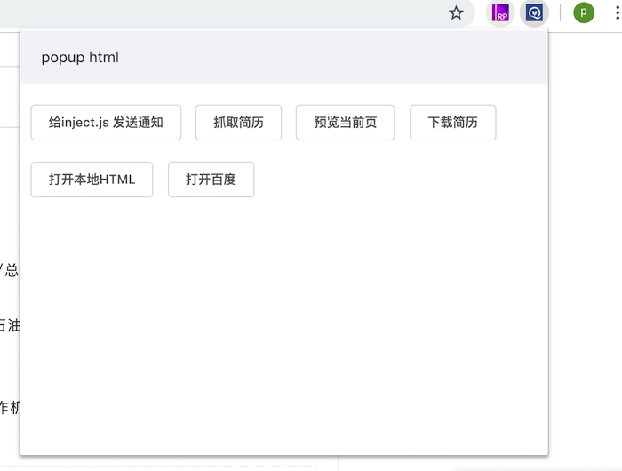
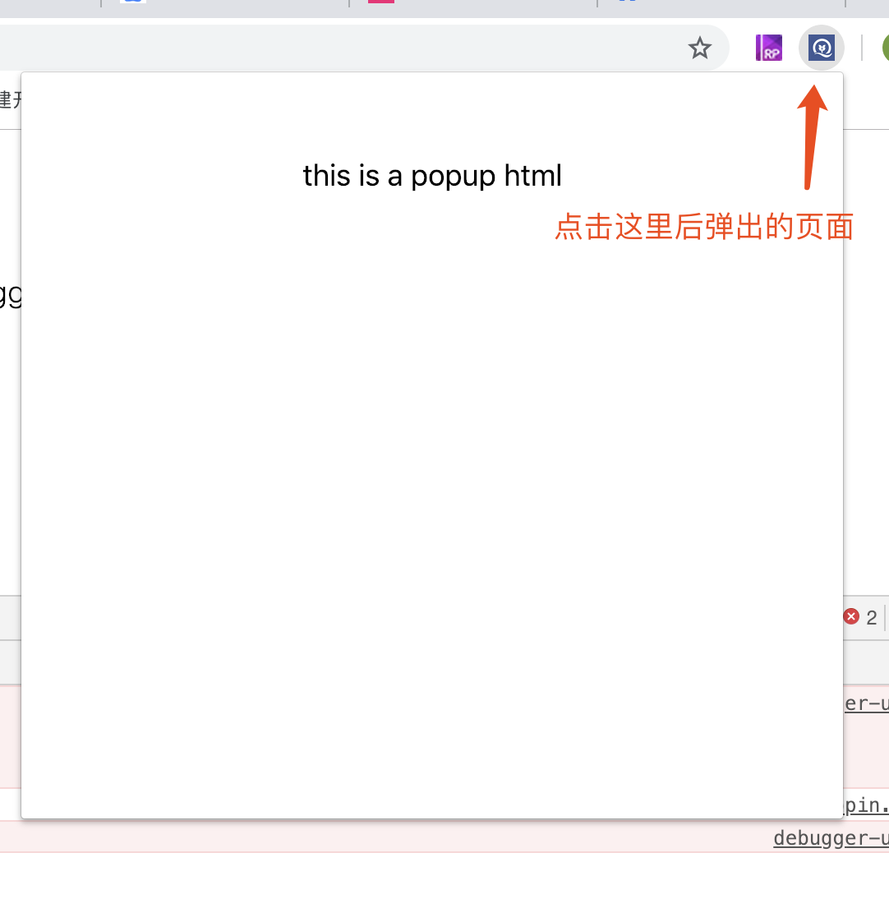
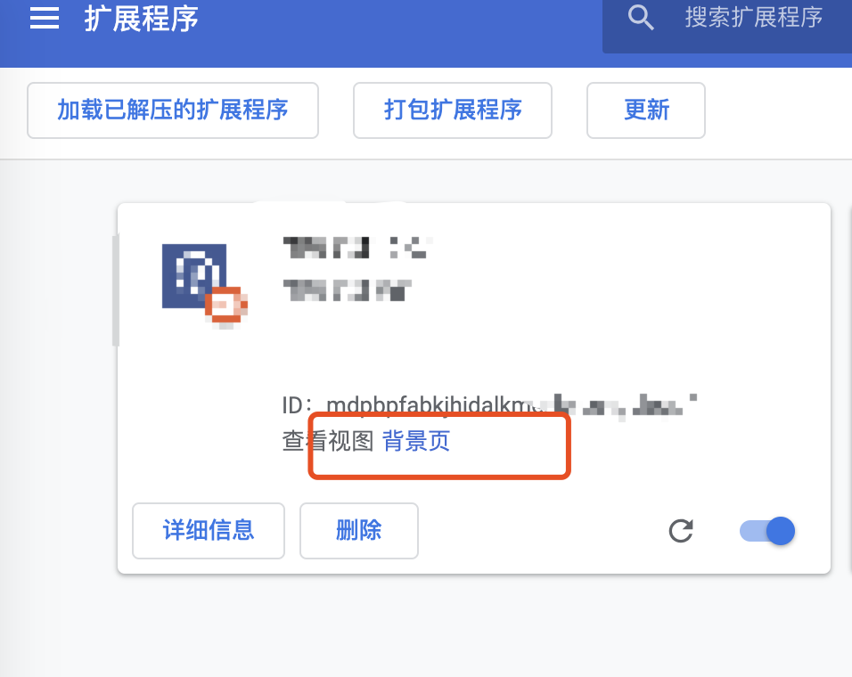

# chrome插件

### demo案例，实现网页内容数据抓取 和部分功能演示（测试页面 仅供学习使用）
- 打开 chrome://extensions/
- 点击加载已解压的扩展程序，选择src目录
- 打开test_page/zp.html
- 点击右上角插件按钮 查看效果



ps: 对url做了验证， 只有打开xxxx/zp.html 才可以点击插件按钮

---

### 最近帮客户做了一个抓简历相关的插件， 这里对chrome插件 做个相关的demo

- manifest.json 这个文件是用来告诉chrome 插件的相关配置 其中主要有3个点 
  - page_action 配置点击插件按钮弹出的html页面

  
  
  - background 配置常驻后台的js代码， 顾名思义这里的代码是跑在后台的，它随着浏览器的打开而打开，随着浏览器的关闭而关闭，一般用来做监听事件和全局代码等等, 可以从下面这里查看console输出

 

  - content_scripts 向指定页面注入的js
  ```
    {
      // 需要直接注入页面的JS
      "content_scripts": 
      [
        {
          "matches": [
            // "https://www.baidu.com/*"
            // "<all_urls>" 表示所有地址
            "<all_urls>"
          ],
          // 多个JS按顺序注入
          "js": [
            "js/jquery-3.3.1.min", "js/script.js"
          ],
          // 
          "css": ["css/custom.css"],
          // 代码注入的时机，可选值： 
          // "document_start" 加载开始前
          // "document_end" 加载完毕后
          // "document_idle" 页面空闲时
          "run_at": "document_start"
        }
      ],
    }
  ```
  值得注意的是，因为安全相关这里的注入的js和原始页面的js是不在一个作用域下，只有dom是共享的， 即： 在注入的js里面 访问不到原始页面的全局变量
  ```
  // raw.js 正常加载的js
  window.foo = 'hello'

  // inject.js 插件注入的js
  console.log(window.foo) // undefined
  ```

```
  // 以下是完整的配置
  {
  "name": "简历抓取",
  "version": "0.0.1",
  // 清单文件版本 必填
  "manifest_version": 2,
  "description": "简历抓取插件",
  // 指定插件的官方网站
  "homepage_url": "https://github.com/Ping5841",
  // 插件icon
  "icons": {
    "16": "images/logo.png",
    "48": "images/logo.png",
    "128": "images/logo.png"
  },
  "page_action": {
    "default_title": "简历抓取",
    "default_icon": "images/logo.png",
    "default_popup": "html/popup.html"
  },
  "background":
  {
    "scripts": ["scripts/jquery-3.3.1.min.js","scripts/background.js"]
  },
  "content_scripts": [
    {
      "js": [
        "scripts/jquery-3.3.1.min.js",
        "scripts/include.js",
        "scripts/zhuopin.js"
      ],
      "matches": [
        "<all_urls>"
      ],
      "run_at": "document_end"
    }
  ],
  // 需要使用的权限，具体请google
  "permissions": [
    "declarativeContent",
    "webRequest",
    "webRequestBlocking",
    "storage",
    "declarativeContent",
    "cookies"
  ],
  "content_security_policy": "script-src 'self'; object-src 'self'"
}

```

---


